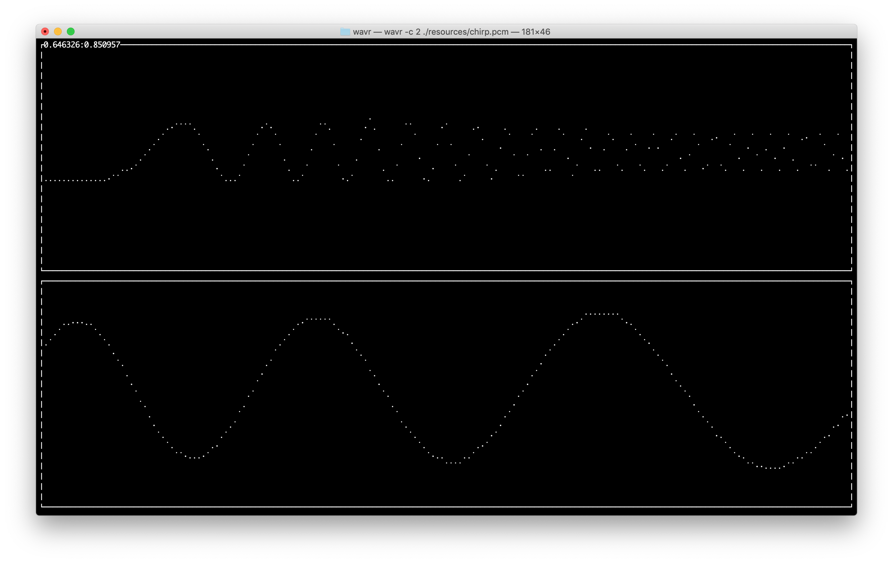

# Waview

View audio files in the terminal.




## Usage
Display the help message
```
$ wavr --help
```

### Controls
* left/right - shift left or right
* up/down - zoom in or out
* r - reset view
* q - quit


## Build

### Build with cargo
```
cargo build
```
