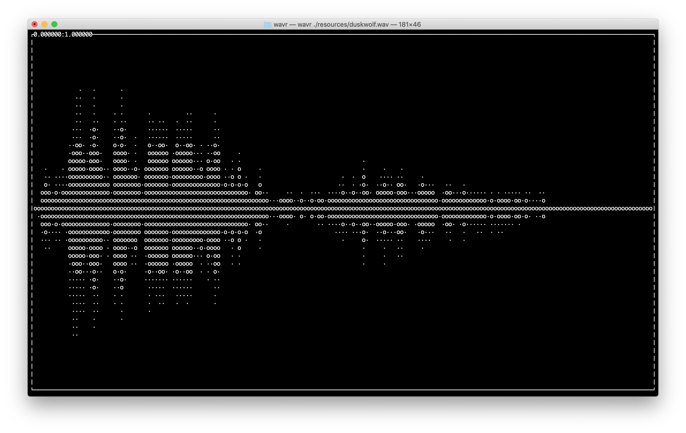

# Waview

View audio files in the terminal.





## Usage
Display the help message
```
wavr --help
```

View a wav file
```
wavr <path/to/file.wav>
```

View a stereo raw PCM file
```
wavr -c 2 <path/to/file.pcm>
```

### Controls
* left/right - shift left or right
* up/down - zoom in or out
* r - reset view
* q - quit


## Build

### Build with cargo
```
cargo build
```
